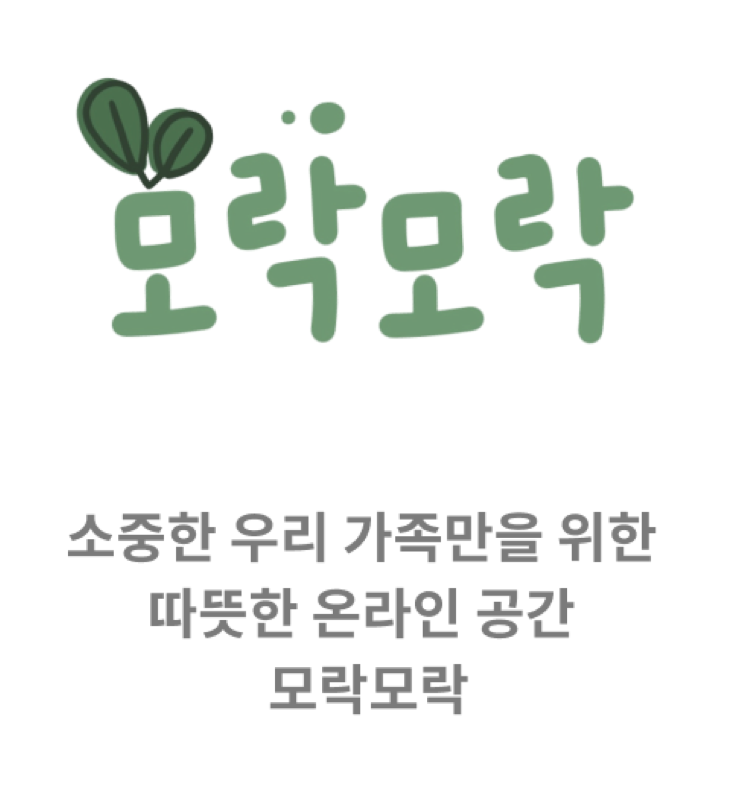

# OSDS-server



<br/>

# 👨‍👩‍👧‍👦 Participants 👨‍👩‍👧‍👦
| name | 역할   |
|-------|----------|
| [unanchoi](https://github.com/unanchoi)| Develop | 
| [na-yk](https://github.com/na-yk)| Leader, Develop | 
| [jinu-kim](https://github.com/jinu-u-kim) | Develop  | 
| [hi-there-insahae](https://github.com/hi-there-insahae)| Develop |


## 🖥 Implementation

##### 0. Virtual Environment
```python
python -m  venv venv
source venv/bin/activate
```

##### 1. Run Server

``` pytho
glt clone https://github.com/NodabFamily/OSDS-server.git

python manage.py migrate

python manage.py runserver
```

## 🗒 Commit Convention
| 제목  | 내용     |
|-------|----------|
| feat | 기능 추가| 
| fix |  버그 수정| 
| refactor | 기능 개선 및 코드 좋은 방향으로 개선  | 
| docs |  문서 관리| 
| style | 코드 스타일 변경, 코드 깔끔하게 관리 | 
| chore | 기본 세팅 및 settings.py 관련, 패키지 관리  | 
